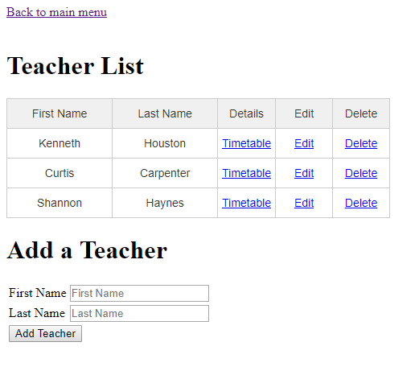

# Simple CRUD web application
Implement a simple [CRUD](https://ru.wikipedia.org/wiki/CRUD) web application

### Technologies used
 - [Spring Framework 4.3.10](http://projects.spring.io/spring-framework/)
 - [Hibernate 5.2.10](http://hibernate.org/)
 - [Maven](https://maven.apache.org/) (To build a project)
 - [Tomcat 9.0.0.M22](http://tomcat.apache.org/)
 - [MySQL](https://www.mysql.com/)